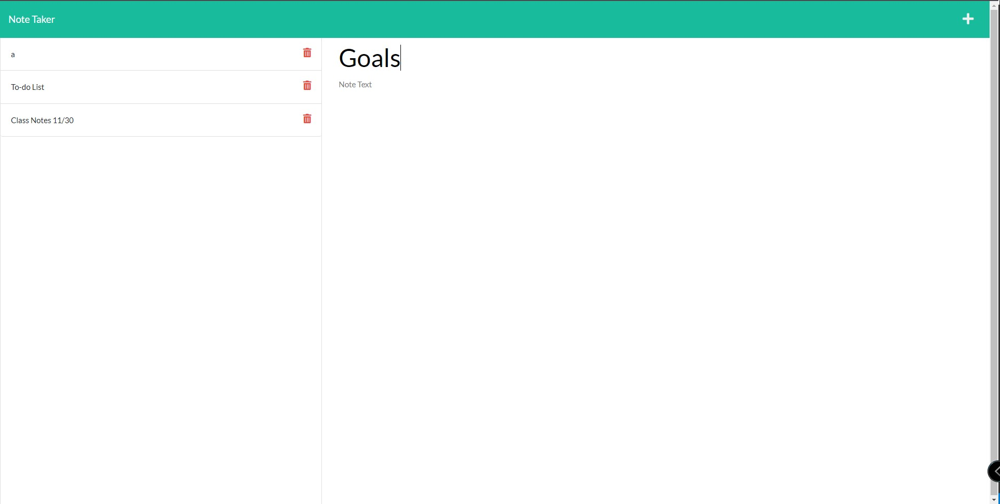

# Note Taker

## Description
Note Taker was designed for the user to take and store notes. You can create and store several seperate notes ranging from grocery list, class notes, etc. Completely up to you!

## Table of Contents
* [Installation](#installation)
* [Usage](#usage)
* [Questions](#questions)

## Installation
* Install Node.js on your computer if you don't have it already
* Type 'npm install' in the command line terminal
* Type 'npm start' in the command line terminal
* Type 'localhost:3005' in your browser to view the application

You can also use the application on [Heroku](https://intense-beyond-26338.herokuapp.com/) 

## Usage
* As mentioned above, this application was built for taking and storing notes.
* Clicking the [link](https://intense-beyond-26338.herokuapp.com/) to the deployed application will bring to the main page. To get started, click the get started button.
* On the note taking page, you have a header, that allows you the option to go back to the home page, create a new note, and save a note.
* The left column shows your saved notes. The center/right column is where you create a note with a title and text.

## Questions
* Email me at <a href= "mailto: brendanjflewis@icloud.com">brendanjflewis@icloud.com</a>
* Check out my Github profile at <a href= "https://www.github.com/brendanjflewis">brendanjflewis</a>